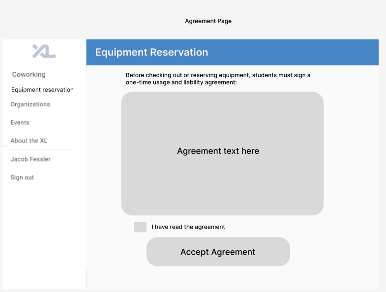
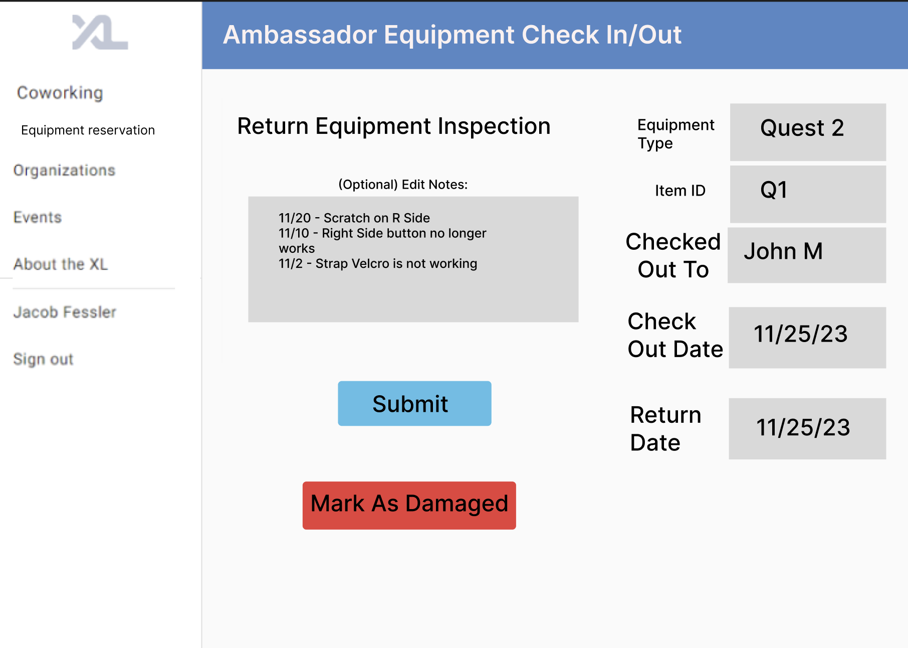

# The Equipment Reservation Station

> A1 Team Members: Benjamin Eldridge, Jacob Fessler, Vitor Inserra, and Andrew Lockard

## 1. Overview

The equipment reservation station is a resource for students to have access to a
system for reserving and borrowing various tech equipment such as AR/VR
Headsets, iPads, iPhones, Androids, Keyboards, and Arduinos. This will enable
learning and development opportunities for students who might not have had
access to more expensive items such as AR/VR headsets, or have never had the
chance to utilize a different platform like iPad, iPhone, Android. An online
system running through the CSXL will make borrowing equipment convenient with
multi-day reservations and the ability to view equipment availability.

## 2. Key Personas

### Sally Student

Students are the main users of the CSXL. They might use it frequently to work and study or go
to office hours if they are held there. In this case, they are familiarized with the CSXL website and possibly have personal communication with the ambassadors.

Students can also not frequently or never use the lab. Then they are probably unfamiliar to the website and have no personal communication with ambassadors. Therefore, it is important to have the feature be accessible through the main menu and possibly have a description of it on the landing page of the CSXL (for non-logged users).

In any case, the student should have a smooth experience viewing and reserving equipments through the website and going to the lab to pick them up or use them. This means the student needs to be able to choose the equipment through the website and see its availability. Then, they should be guided through the process of picking it up and be informed about when the session ends (it would help if they are also notified via message or email at that time).

The student should also be able to sign agreements required to reserve an equipment through the website, in case of breaking or losing pieces of equipments.

### Amy Ambassador

Ambassadors are the main personas responsible for organizing the lab. They will be the keeping track of returns, communicating with students and completing other essential parts of the equipment reservation process. The majority of their tasks will be completed through the CSXL website, although they can probably rely on communicating with students personally during the reservation.

Also, ambassadors should be able to confirm information about reservations, notify any unpredicted changes to students that made reservations, and edit reservations.

The main tasks of an ambassador will be tracking items through unique identifiers (given they might be of the same model/type) and checking them back in upon return. They should also be able to describe any damage or abnormalities with the material when they check it in.

### Rhonda Root

Roots will be responsible for the one-time operations such as adding and removing items from the library. They should be able to submit a new item with all its details so be shown in the library.

## 3. User Stories

### Story A

As Rhonda Root, I want to have a management page with a list of items and an add button that allows me to add a new item to the library of available equipment to be reserved through a form, so that they appear to students through the website. I also want an edit button that allows changing information about the item and a delete button that removes the item from the database.

Subtasks:

1. There should be a field to add a picture of the item, a title, and a description. (Also possibly a field for max reservation span).
2. Equipment information should be saved to the database.

### Story B

As Sally Student, I will be prompted with a proposal to sign the liability agreement on my first access on the equipment reservation page or if the agreement changes, so that I don't have to sign it every time I want to lend an item.

Subtasks:

1. Add a database column on the Student model called `agreement_status` and set it to false.
2. Show the liability agreement when the student enters the URL path `/equipment-reservations` if the current version is not yet signed.
3. Save the status to a database after signed.
4. Make sure the student cannot access the library page until they sign the agreement.

### Story C

As any persona, I want to be able to access the equipments reservation page through the main menu.

Subtasks:

1. All personas hould be taken to the URL path of `/equipment-reservations`.

### Story D

As any Persona I want to view the library of equipments and their availability status (available at that moment or not), so that I can pick what I want to reserve.

Subtasks:

1. Show cards of equipments with title, picture, and availability.
2. Order each equipment first by type, then by availability. This means item available at that moment will be shown first.

### Story E

As any Persona, I want to click on an item and be taken to the items page on path `/equipment-reservations`, so that I can expand the item details and see information about reserving the item.

Subtasks:

1. Showing a reservation chart (possibly an hourly calendar of the week). This will be developed in next steps, so for now just have this item exist here and call a `show_reservation_calendar` widget.

### Story F

As Sally Student, I should be able to reserve equipment using the calendar item, so that I can easily set the preferred times or dates.

Subtasks:

1. Set a notification for when the user's reserved session ends.
2. Implement the `show_reservation_calendar` widget.
3. Make sure a student cannot reserve more than one item at a time.

### Story G

As Amy Ambassador, I should be able to see a management page where I can see a list of equipments and check an equipment in through its unique ID and log details or any abnormalities noted by the student about the equipment on return.

- Logging details will serve as an incentive to review the equipment with more attention, besides tracking when products were damaged.

Subtasks:

1. Entering unique ID number or scanning a QR code to find the item in the database.
2. Save the check-in to a database.

### Story H

As Sally Student, I should be able to see my checkout history, because I want to keep track of the I have checked out and all my due dates.

### Story I

As Amy Ambassador, I should be able to see previous reservations of a unique item, so that I can look at previous description.

### Opportunities for Extra Stories

1. Filtering items by availability, type, etc.
2. Saving favorite equipments or most used.
3. Instead of showing every single unique item and its availability, show just the type of equipment and a single calendar for all their combined availability.
4. Club leaders can checkout multiple materials.
5. Remove or add to availability.
6. Student did not return on expected date button.
7. Email notifications.

## 4. Wireframes

### Story A and B

Equipment reservation is added to the navbar menu. Before checking out an item for the first time, Sally Student must view and accept the agreement.

### Story C

User Admin's will have this view of equipment types. They can create a new equpiment using the "Create" button and filling out the following form. They can also click on the "View/Edit" button to add Equipment Items and change details about the equipment type.

In this view, the Admin can edit the type fields, add/delete new items, view (possibly edit) notes, and flag/unflag items as damaged. Flagging an item as damaged will remove it from the available item pool that students can reserve from.

### Story D

Both Amy Ambassador and Sally Student should be able to access the library of equipment and their availability status. Each type of equipment is listed in its own card that is grouped by whether it is currently available. Each card has a button that redirects to a page to view availability and checkout. Cards in the currently available section have the button labeled "checkout"; cards in the currently unavailable section have the button labeled "view availability". The my checkouts button links to Sally Student's checkout history.

Sally Student can view current and previous checkouts including device ID, type, dates, and status.

### Story E and F

Valid date range

Invalid date range

Both Amy Ambassador and Sally Student can view a page with availability of a type of equipment displayed in a grid. The page for each type has a brief description, and instructions for using the grid widget to select dates. If a valid date range is selected, the user can checkout the device with the button.

### Story G and H

Ambassadors will see an "Ambassadors" button to allow them to navigate to the ambassadors equipment page.

In this view, ambassadors will see 2 lists, one for pending check outs, or reservations, that are upcoming, and can click on the "Lend" button when the student comes to pick up their equipment. The other list will contain the equipment that has been checked out along with the due date that it is back. When a student drops off their used equipment, the ambassador will click on the "return" button and will be redirected to the inspection page.

This view will contain the same information as the previous, but will also include any previous notes on product damage. The Ambassador can edit the notes if any extra wear/tear is noticed. If none, or after adding notes, the ambassador can click the "Submit" button to complete the check-in. Additionally, if the equipment is damaged beyond use, the ambassador can click the "Mark As Damaged" button, then should communicate with the admin to discuss next steps.

## 5. Technical Requirements Implementation Opportunities and Planning

### 1. Direct Dependencies from Original Code Base

a. Authentication and permissions: this will be essential for access to the each URL path.

b. User model: will be used for all reservation and agreement functionalities.

c. Ambassador model: will be used for all CSXL-side functionalities, except permanently adding or removing equipments.

d. Root model: will be used for permanently adding and removing equipments.

e. Menu component: should continue to appear or collapse into hamburger (in case of smaller screens).

f. Search bar: may be available for search when there are multiple items to choose from.

g. `XL` icons: should continue to be used in tab title.

### 2. Planned Page Components and Widgets

a. Library Component: includes a list of all the types of equipments available, by exact model.

b. Ambassador's View Component: includes a list of all unique items and at least filter or ordering by type. Should allow displaying or removing an item from display.

c. Root's Management Component: includes a list of all unique items and allow adding, editing and deleting.

c. Equipment Component: includes all details about an equipment type.

d. Agreement Component: shows the liability agreement and allow signing.

e. Calendar Widget: shows all the available and unavailable dates for each item, as well as how many items are available.

f. Check-in Component: allows checking items back in.

### 3. Additional and Edited Models

a. User Model:

- `agreement_status` column should be added to track if the student has signed it or not.

b. Equipment Type Model: additional model that contains equipment specifications.

- `title`
- `picture`
- `description`
- `max_reservation_time` should be used to make limit the time of a reservation appointment.

c. Unique Item Model: additional model contains unique items and necessary information.

- `id` column should be a unique identification number.
- `equipment_type` relational mapping that connects the unique item to the Equipment Type Model.
- `display_status` true if item is available for display, false if not.

d. Reservations Model: additional model to track all reservations and returns

- `item_id` relates what unique item was reserved.
- `user_id` relates what user reserved the item.
- `check_out_date` contains the date the student is first getting the item.
- `ambassador_check_out` boolean that track if the student actually checked out the item (should be used to cancel the reservation if not true after the expected date).
- `expected_return_date` contains the date the student should return the item.
- `actual_return_date` contains the date the student actually returned the item.
- `return_description` contains the description of the item after the student returned.

### 4. API Route Modifications and Additions

1.  Modifications: No existing routes will need any modifications for the
    addition of this new equipment reservation system.

2.  Additions: A new directory for all equipment related routes will be created
    with the following files.

    - `equipment_reservation.py`
    - `equipment_ambassador.py`
    - `equipment_admin.py`

    `equipment_reservation.py` will contain the routes:

    - `draft_equipment_reservation` - `POST`
    - `get_equipment_reservation` - `GET`
    - `list_all_equipment_availability` - `GET`
    - `get_item_availability` - `GET`
    - `update_reservation` - `PUT`
    - `cancel_reservation` - `DELETE`
    - `update_user_agreement_status` - `PUT`
    - `get_item_details` - `GET`

    These will function in a similar way to the current coworking reservation
    routes as Sally Student will interact with the UI similarly with the
    ability to draft (`draft_equipment_reservation`), update
    (`update_reservation`) and cancel (`cancel_reservation`) reservations.
    Listing all equipment reservations (`list_all_equipment_availability`) as
    well as a specific item's reservations (`get_equipment_reservation`) will
    be possible for different menus (such as the equipment reservations page
    and the calendar page for a certain item). Additionally, in the same area
    as the reservations we need to have a way to update the user agreement
    status (`get_user_agreement`) and get item details (`get_item_details`).

    `equipment_ambassador.py` will contain the routes:

    - `create_equipment_checkout` - `POST`
    - `active_and_upcoming_equipment_reservations` - `GET`
    - `checkin_equipment` - `POST` (or possibly `PUT`)

    Similarly to co-working reservations, Amy Ambassador (or Rhonda Root) will
    interact with these routes to view all types of reservations
    (`active_and_upcoming_equipment_reservations`) and confirm a checkout
    (`create_equipment_checkout`) that was started online. Additionally, the
    ambassador will need to be able to check equipment back in
    (`checkin_equipment`) as well, which can simultaneously send information
    about any possible damage to the equipment.

    `equipment_admin.py` will contain the routes:

    - `add_equipment_type` - `POST`
    - `modify_equipment_type` - `PUT`
    - `delete_equipment_type` - `DELETE`

    Only Rhonda Root will be able to access these routes to add, modify and
    delete equipment types in the system. Modification of the equipment type
    can be the method of marking equipment as broken.

### 5. Security and Privacy Concerns

As discussed previously, equipment type additions, modifications, and deletions
are all exclusive to Rhonda Root as these are infrequent actions of the highest
security. Additionally, the final equipment checkins and checkouts are
exclusive to Amy Ambassador and Rhonda Root in order to maintain the security
of expensive equipment items. Any role, but generally Sally Student can view
availability and create, update, and delete reservations however no other
student should be able to see these created reservations to maintain privacy.
However, viewing data such as availability, item details, and the user
agreement are open to every user.
