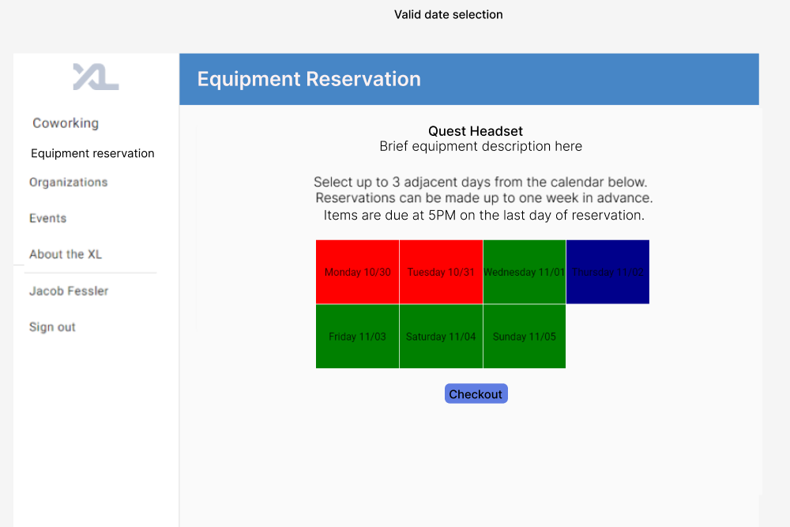

# The Equipment Reservation Station

> A1 Team Members: Benjamin Eldridge, Jacob Fessler, Vitor Inserra, and Andrew Lockard

## Overview

The equipment reservation station is a resource for students to have access to a
system for reserving and borrowing various tech equipment such as AR/VR
Headsets, iPads, iPhones, Androids, Keyboards, and Arduinos. This will enable
learning and development opportunities for students who might not have had
access to more expensive items such as AR/VR headsets, or have never had the
chance to utilize a different platform like iPad, iPhone, Android. An online
system running through the CSXL will make borrowing equipment convenient with
multi-day reservations and the ability to view equipment availability.

## 2. Key Personas

### Sally Student

Students are the main users of the CSXL. They might use it frequently to work and study or go
to office hours if they are held there. In this case, they are familiarized with the CSXL website and possibly have personal communication with the ambassadors.

Students can also not frequently or never use the lab. Then they are probably unfamiliar to the website and have no personal communciation with ambassadors. Therefore, it is important to have the feature be accessible through the main menu and possibly have a description of it on the landing page of the CSXL (for non-logged users).

In any case, the student should have a smooth experience viewing and reserving equipments through the website and going to the lab to pick them up or use them. This means the student needs to be able to choose the equipment through the website and see its availability. Then, they should be guided through the process of picking it up and be informed about when the session ends (it would help if they are also notified via message or email at that time).

The student should also be able to sign agreements required to reserve an equipment through the website, in case of breaking or losing pieces of equipments.

### Amy Ambassador

Ambassadors are the main personas responsible for organizing the lab. They will be the people adding and removing items from the library, keeping track of returns, and compeleting other essential parts of the equipment reservation process. The majority of their tasks will be completed through the CSXL website, although they can probably rely on communicating with students personally during the reservation.

Also, ambassadors should be able to confirm information about reservations, notify any unpredicted changes to students that made reservations, and edit reservations.

The main tasks of an ambassador will be tracking items through unique identifiers (given they might be of the same model/type) and checking them back in upon return. They should also be able to describe any damage or abnormalities with the material when they check it in.

## 3. User Stories

### Story A

As any persona, I want to be able to access the equipments reservation page through the main menu.

Subtasks:

1. Students should be taken to the URL path of `/equipment-reservations/student`. Users who are not logged in should not be allowed on this path.
2. Ambassadors should be taken to the URL path of `/equipment-reservations/ambassador`. Students and users who are not logged in should not be allowed in this URL path.

### Story B

As Sally Student, I will be prompted with a proposal to sign the liability agreement at my first access on the equipment reservation page or if the agreement changes, so that I don't have to sign it every time I want to lend an item.

Subtasks:

1. Add a database column on the Student model called `agreement_status` and set it to false.
2. Show the liability agreement when the student enters the URL path `/equipment-reservations/student` if the current version is not yet signed.
3. Save the status to a database after signed.

### Story C

As Amy Ambassador, I want to have an add button that allows me to add a new item to the library of available equipment to be reserved through a form, so that they appear to students through the website.

Subtasks:

1. There should be a field to add a picture of the item, a title, and a description. (Also possibly a field for max reservation span).
2. Equipment information should be saved to the database.

### Story D

As any Persona - that is, on both URL paths `/ambassador` and `/student` - I want to view the library of equipments and their availability status (available at that moment or not), so that I can pick what I want to reserve.

Subtasks:

1. Show cards of equipments with title, picture, and availability.
2. Order each equipment first by type, then by availability. This means item available at that moment will be shown first.

### Story E

As any Persona, I want to click on an item and be taken to the items page on URL path `/equipment-reservations/<user type>/<item name>`, so that I can expand the item details and see information about reserving the item.

Subtasks:

1. Showing a reservation chart (possibly an hourly calendar of the week). This will be developed in next steps, so for now just have this item exist here and call a `show_reservation_calendar` widget.
2. On the `/ambassador` path only, I should be able to see an edit button that allows me to change information about the item and a delete button that allows me to remove the item.

### Story F

As Sally Student, I should be able to reserve equipment using the calendar item, so that I can easily set the preffered times or dates.

Subtasks:

1. Set a notification for when the user's reserved session ends.
2. Implement the `show_reservation_calendar` widget.

### Story G

As Amy Ambassador, I should be able to check the equipment in through its unique ID and log details or any abnormalities noted by the student about the equipment on return.

- Logging details will serve as an incentive to review the equipment with more attention, besides tracking when products were damaged.

Subtasks:

1. Entering unique ID number or scanning a QR code to find the item in the database.
2. Save the check-in to a database.

### Opportunities for Extra Stories

1. Filtering items by availability, type, etc.
2. Saving favorite equipments or most used.
3. Instead of showing every single unique item and its availability, show just the type of equipment and a single calendar for all their combined availability.

## 4. Wireframes
### Story A and B

Equipment reservation is added to the navbar menu.  Before checking out an item for the first time, Sally Student must view and accept the agreement.

### Story D

Both Amy Ambassador and Sally Student should be able to access the library of equipment and their availability status.  Each type of equipment is listed in its own card and grouped by whether it is available or not with a brief description.  Available equipment types have a button that links to story E.  The my checkouts button links to Sally Student's checkout history.

Sally Student can view current and previous checkouts including device ID, type, dates, and status.
### Story E and F
Valid date range

Invalid date range

Both Amy Ambassador and Sally Student can click on the checkout button for available equipment types. These equipment types have a brief description, and instructions for using a calendar widget to checkout the equipment.  If a valid date range is selected, the button will be styled as active and work, if not the button will be grayed out and not work. The number of available devices is listed beneath each date.
